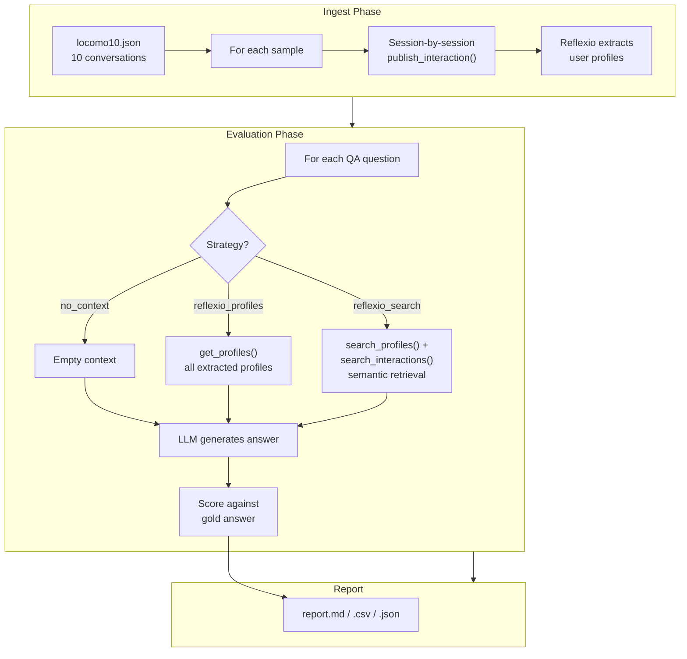

# LoCoMo Benchmark for Reflexio

Evaluate Reflexio's long-term memory against the **LoCoMo** (Long-Context Conversation with Memory) dataset — a benchmark of extended, multi-session dialogues with gold-standard QA annotations.

## LoCoMo Dataset

LoCoMo was introduced in [*"LoCoMo: Long-Context Conversation with Memory"*](https://arxiv.org/abs/2402.12498) (ACL 2024) by Snap Research.

| Property | Value |
|---|---|
| Conversations | 10 (locomo10 subset) |
| Sessions per conversation | ~7–10, spanning weeks/months |
| Turns per conversation | ~300 |
| Speakers per conversation | 2 (two friends) |
| QA categories | 5 (see below) |

**QA categories:**

| # | Category | Metric | Description |
|---|---|---|---|
| 1 | Multi-hop | Token F1 (avg over sub-answers) | Requires reasoning across multiple turns |
| 2 | Single-hop | Token F1 | Single factual question |
| 3 | Temporal | Token F1 | Time-based questions |
| 4 | Open-domain | Token F1 | General knowledge from conversation |
| 5 | Adversarial | Accuracy (correct refusal) | Questions with no answer in the context |

**Source:** [snap-research/locomo](https://github.com/snap-research/locomo)

## What This Benchmark Does

This benchmark evaluates how well Reflexio's extracted profiles and semantic search compare against a no-context baseline for answering questions about long-term dialogues.

**Three retrieval strategies** are compared:

| Strategy | Context source |
|---|---|
| `no_context` | Empty — tests LLM baseline |
| `reflexio_profiles` | All profiles via `get_profiles(top_k=200)` |
| `reflexio_search` | Semantic search via `search_profiles(top_k=20)` + `search_interactions(top_k=20)` |

**Modules:**

| File | Role |
|---|---|
| `run_benchmark.py` | CLI entry point |
| `config.py` | Constants (strategies, defaults) |
| `data_loader.py` | Parse locomo10.json |
| `ingest.py` | Ingest conversations into Reflexio |
| `baselines.py` | Context retrieval per strategy |
| `answer_generator.py` | LLM answer generation via LiteLLM |
| `evaluate_qa.py` | Evaluation loop with checkpoint/resume |
| `metrics.py` | Scoring (token F1, adversarial accuracy) |
| `report.py` | Aggregate and export results |

## How Reflexio Integrates



**Speaker mapping:** Each LoCoMo sample has two named speakers. During ingestion, `speaker_a` is mapped to the `User` role and `speaker_b` to `Assistant`, so Reflexio's profile extractor treats `speaker_a` as the primary user.

**Profile extractor config:** A custom extractor (`locomo_memory`) is configured to extract names, occupations, family, hobbies, preferences, life events, travel, health, relationships, and dates — tuned for the long-term friendship conversations in LoCoMo.

## How to Run

### Prerequisites

- Reflexio server running (default: `http://localhost:8081`)
- `REFLEXIO_API_KEY` set in environment or `.env`
- A LiteLLM-compatible model API key (default model: `minimax/MiniMax-M2.5`)

### Download the dataset

```bash
wget -O benchmarks/locomo/data/locomo10.json \
    https://raw.githubusercontent.com/snap-research/locomo/main/data/locomo10.json
```

### Run examples

```bash
# Full pipeline: ingest + evaluate all strategies
uv run python benchmarks/locomo/run_benchmark.py

# Baseline only (no Reflexio server needed)
uv run python benchmarks/locomo/run_benchmark.py \
    --strategies no_context

# Reflexio strategies only, skip ingestion (data already in Reflexio)
uv run python benchmarks/locomo/run_benchmark.py \
    --strategies reflexio_profiles reflexio_search \
    --skip-ingest

# Quick test: first 2 samples with verbose logging
uv run python benchmarks/locomo/run_benchmark.py \
    --max-samples 2 -v

# Custom model, parallel ingestion, specific samples
uv run python benchmarks/locomo/run_benchmark.py \
    --model gpt-4o \
    --ingest-workers 4 \
    --samples 0 1 2

# Resume a previous run (automatically skips completed sample/strategy pairs)
uv run python benchmarks/locomo/run_benchmark.py
```

### CLI arguments

| Argument | Default | Description |
|---|---|---|
| `--data-file` | `benchmarks/locomo/data/locomo10.json` | Path to dataset |
| `--strategies` | all three | Strategies to evaluate (`no_context`, `reflexio_profiles`, `reflexio_search`, `all`) |
| `--model` | `minimax/MiniMax-M2.5` | LiteLLM model for answer generation |
| `--reflexio-url` | `http://localhost:8081` | Reflexio server URL |
| `--reflexio-api-key` | `$REFLEXIO_API_KEY` | API key for Reflexio |
| `--skip-ingest` | false | Skip ingestion phase |
| `--ingest-workers` | 1 | Parallel ingestion threads |
| `--output-dir` | `benchmarks/locomo/output` | Output directory |
| `--samples` | all | Specific sample IDs to evaluate |
| `--max-samples` | all | Max number of samples to use (first N; for quick testing) |
| `-v` / `--verbose` | false | Enable DEBUG-level logging |

### Output

Results are written to the output directory:

- **`report.md`** — Markdown table of scores per strategy and category
- **`report.csv`** — Same table in CSV format
- **`report.json`** — Full per-question results + aggregated summary
- **`checkpoint.json`** — Resume state (delete to re-run from scratch)

Logs are saved to `benchmarks/locomo/logs/` (one file per run, always at DEBUG level regardless of `-v`).

Example output (`report.md`):

```
| Strategy          | Multi-Hop | Single-Hop | Temporal | Open-Domain | Adversarial | Overall |
|-------------------|-----------|------------|----------|-------------|-------------|---------|
| reflexio_search   | 0.210     | 0.420      | 0.055    | 0.380       | 0.900       | 0.445   |
| reflexio_profiles | 0.105     | 0.210      | 0.030    | 0.190       | 0.950       | 0.320   |
| no_context        | 0.000     | 0.000      | 0.000    | 0.002       | 1.000       | 0.237   |
```
