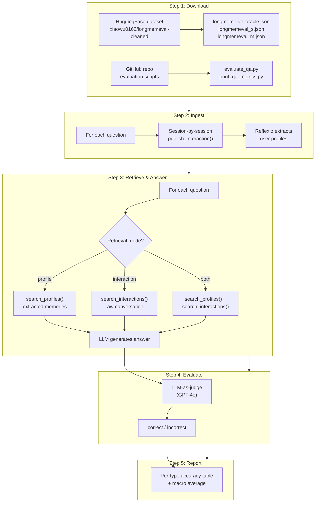

# LongMemEval Benchmark for Reflexio

Evaluate Reflexio's long-term memory against the **LongMemEval** benchmark — a dataset of multi-session conversations with QA tasks testing different memory capabilities.

## LongMemEval Dataset

LongMemEval was introduced in [*"Leave No Knowledge Behind During Knowledge Distillation: Towards Practical and Effective Knowledge Distillation with Data-Free Methods"*](https://github.com/xiaowu0162/LongMemEval) by Wu et al., designed to evaluate long-term memory in conversational AI systems.

| Property | Value |
|---|---|
| Source | [xiaowu0162/longmemeval-cleaned](https://huggingface.co/datasets/xiaowu0162/longmemeval-cleaned) (HuggingFace) |
| GitHub | [xiaowu0162/LongMemEval](https://github.com/xiaowu0162/LongMemEval) |
| Variants | 3: `oracle`, `s` (small), `m` (medium) |
| Question types | 5 (see below) |
| Evaluation method | LLM-as-judge (GPT-4o, >97% human agreement) |

**Question types:**

| # | Type | Description |
|---|---|---|
| 1 | `information_extraction` | Extract specific facts mentioned in past conversations |
| 2 | `multi_session_reasoning` | Reason across information from multiple sessions |
| 3 | `knowledge_update` | Recognize when later information supersedes earlier statements |
| 4 | `temporal_reasoning` | Answer time-dependent questions using conversation dates |
| 5 | `abstention` | Correctly refuse to answer when information was never discussed |

## What This Benchmark Does

This benchmark evaluates how well Reflexio's extracted profiles and semantic search can answer questions about long-term user conversations. Each question's conversation history is ingested into Reflexio, then the benchmark retrieves memories to answer QA tasks.

**Three retrieval modes** are compared:

| Mode | Context source |
|---|---|
| `profile` | Extracted user profiles via `search_profiles()` |
| `interaction` | Raw conversation excerpts via `search_interactions()` |
| `both` | Combined profile + interaction results |

**Pipeline steps:**

| Step | Description |
|---|---|
| 1. Download | Fetch dataset from HuggingFace + eval scripts from GitHub |
| 2. Ingest | Publish conversation sessions into Reflexio per question |
| 3. Retrieve & Answer | Search Reflexio memories, generate answers via LLM |
| 4. Evaluate | LLM-as-judge scores each answer against ground truth |
| 5. Report | Aggregate per-type and overall accuracy metrics |

**Modules:**

| File | Role |
|---|---|
| `run_benchmark.py` | CLI entry point — orchestrates the full 5-step pipeline |
| `config.py` | Shared paths, naming helpers, Reflexio extraction config |
| `download_data.py` | Download HuggingFace dataset + GitHub eval scripts |
| `01_ingest.py` | Ingest conversation sessions into Reflexio with checkpointing |
| `02_retrieve_and_answer.py` | Retrieve memories and generate LLM answers |
| `03_evaluate.py` | LLM-as-judge evaluation (correct/incorrect) |
| `04_report.py` | Aggregate metrics and print per-type accuracy tables |

## How Reflexio Integrates



**User mapping:** Each LongMemEval question has its own conversation history (`haystack_sessions`). During ingestion, a unique `user_id` is created per question (e.g., `lme_oracle_42`) and all sessions are published via `publish_interaction()` with checkpoint-based resumability.

**Profile extractor config:** A custom extractor (`longmemeval_facts`) is configured to extract personal facts, preferences, past experiences, opinions, plans, relationships, professional details, and specific numbers/dates — with temporal context tracking for knowledge updates.

## How to Run

### Prerequisites

- Reflexio server running (default: `http://localhost:8081`)
- `REFLEXIO_API_KEY` set in environment or `.env`
- A LiteLLM-compatible model API key (default answer model: `minimax/MiniMax-M2.5`)
- For evaluation: OpenAI API key (default judge: `gpt-4o`)

### Run examples

```bash
# Full pipeline: download → ingest → retrieve → evaluate → report
uv run python benchmarks/longmemeval/run_benchmark.py \
    --variant oracle \
    --retrieval-mode profile

# Skip download and ingest (data already in Reflexio)
uv run python benchmarks/longmemeval/run_benchmark.py \
    --variant oracle \
    --retrieval-mode profile \
    --skip-download --skip-ingest

# Run on a subset of questions
uv run python benchmarks/longmemeval/run_benchmark.py \
    --variant oracle \
    --retrieval-mode both \
    --start-idx 0 --end-idx 10

# Custom models
uv run python benchmarks/longmemeval/run_benchmark.py \
    --variant oracle \
    --retrieval-mode profile \
    --answer-model gpt-4o \
    --judge-model gpt-4o

# Compare retrieval modes (run multiple times, then compare reports)
uv run python benchmarks/longmemeval/run_benchmark.py --variant oracle --retrieval-mode profile
uv run python benchmarks/longmemeval/run_benchmark.py --variant oracle --retrieval-mode interaction
uv run python benchmarks/longmemeval/run_benchmark.py --variant oracle --retrieval-mode both
```

### CLI arguments

| Argument | Default | Description |
|---|---|---|
| `--reflexio-api-key` | `$REFLEXIO_API_KEY` | Reflexio API key |
| `--reflexio-url` | `http://localhost:8081` | Reflexio server URL |
| `--variant` | `oracle` | Dataset variant: `oracle`, `s`, `m` |
| `--data-file` | auto (based on variant) | Override data file path |
| `--retrieval-mode` | `profile` | Retrieval mode: `profile`, `interaction`, `both` |
| `--answer-model` | `minimax/MiniMax-M2.5` | LLM for answer generation |
| `--judge-model` | `gpt-4o` | LLM judge for evaluation |
| `--top-k` | `20` | Max retrieval results |
| `--threshold` | `0.3` | Similarity threshold for profile search |
| `--start-idx` | `0` | Start question index (inclusive) |
| `--end-idx` | all | End question index (exclusive) |
| `--sleep` | `1.0` | Seconds between ingestion publishes |
| `--skip-download` | false | Skip step 1: download data |
| `--skip-ingest` | false | Skip step 2: ingest into Reflexio |
| `--skip-retrieve` | false | Skip step 3: retrieve & answer |
| `--skip-evaluate` | false | Skip step 4: evaluate answers |
| `--skip-report` | false | Skip step 5: print report |

### Output

Results are written to `benchmarks/longmemeval/output/`:

- **`ingest_state/{variant}/{question_id}.done`** — Checkpoint files for resumable ingestion
- **`hypotheses/{variant}_{mode}.jsonl`** — Generated answers (one JSON object per line)
- **`eval_results/{variant}_{mode}_eval.jsonl`** — Scored results with `autoeval_label`

Example output (report printed to stdout):

```
============================================================
 Results: oracle_profile_eval
============================================================
Question Type                  Correct    Total   Accuracy
------------------------------ -------- -------- ----------
information_extraction               12       20      60.0%
multi_session_reasoning               5       15      33.3%
knowledge_update                      8       12      66.7%
temporal_reasoning                    4       10      40.0%
abstention                            9       10      90.0%
------------------------------ -------- -------- ----------
Overall                              38       67      56.7%
Macro Average                                         58.0%
```
